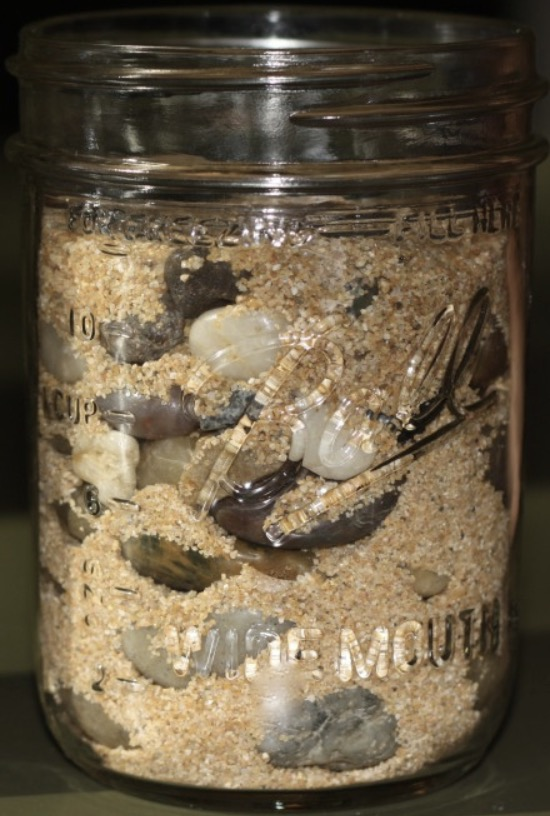

<button>[回到首页](../index.md)</button>

在我们进行无障碍改造时，我们推荐按照以下步骤进行：
- 先用Fusion组件完成组件层面的替换，这样可以凭借Fusion组件自身的无障碍支持，实现我们页面大部分的无障碍，详情[请点击](./component-usage.md)
- 再根据我们提供的checklist，您能够迅速完成一轮对无障碍性的自我检查，详情[请点击](./checklist.md)
- 在完成上述两步后，我们能够完成页面大部分的无障碍改造，但是还有一些是细节需要各位开发者格外注意，我们将这些案例一一收集起来，详情[请点击](./content-creation.md)

上述的改造过程，就如同用石头填满一个玻璃瓶，一开始我们用大的石块装满这个瓶子，但是还有较大的空间；然后我们将小石子继续塞进去填满这些空间，但是仍然有一些小空隙；最后我们倒入沙子，终于填满了这个瓶子。

